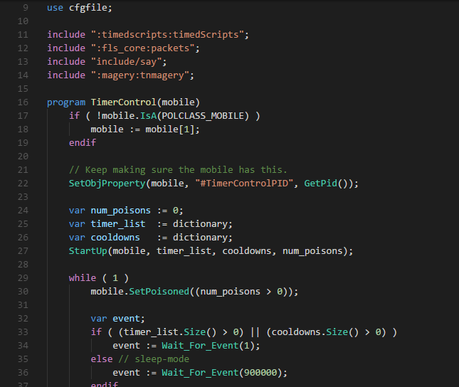

# Polscript README
This is a hightlight colorizer for polscript, to be used in Visual Code. 
It's based on PHP language, and itsn't done yet. But is better than nothing. 
Please, contribute if you can! Any help counts ! =] 

### Install the extention
* To start using your extension with Visual Studio Code copy it into the <user home>/.vscode/extensions folder and restart Code.

### What's in the folder
* This folder contains all of the files necessary for your extension
* `package.json` - this is the manifest file in which you declare your language support and define
the location of the grammar file that has been copied into you extension.
* `syntaxes/polscript.tmLanguage` - this is the Text mate grammar file that is used for tokenization
* `polscript.configuration.json` - this the language configuration, defining the tokens that are used for
comments and brackets.

### Make changes
* you can relaunch the extension from the debug toolbar after making changes to the files listed above
* you can also reload (`Ctrl+R` or `Cmd+R` on Mac) the VS Code window with your extension to load your changes

### Add more language features
* To add features such as intellisense, hovers and validators check out the VS Code extenders documentation at
https://code.visualstudio.com/docs